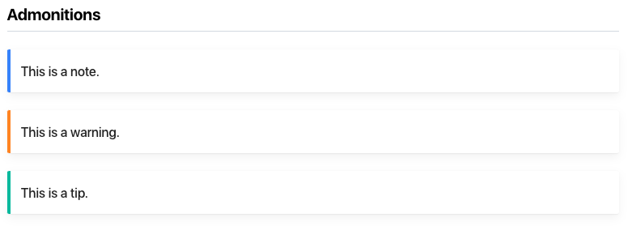

The site theme is based on [MkDocs Material](https://squidfunk.github.io/mkdocs-material/) and Material-insiders. Material-insiders requires access to the [Seqera Gitea](https://git.seqera.io/) repository. See [MkDocs](./mkdocs.md). 

We favor [GitHub-flavored Markdown](https://github.github.com/gfm/). 

## Headers

The document title serves as the top-level heading, so we do not introduce a page with a heading.

We use heading 2 (##) for main sections and increase heading level by 1 for each subsection level. 

## Admonitions

We use MkDocs Material [admonitions](https://squidfunk.github.io/mkdocs-material/reference/admonitions/#removing-the-title) without titles (e.g., `!!! note ""`):

!!! note ""
    This is a note. 

!!! warning ""
    This is a warning. 

!!! tip ""
    This is a tip. 



## Example blocks

We use [collapsible admonition blocks](https://squidfunk.github.io/mkdocs-material/reference/admonitions/#collapsible-blocks) for examples:

`???+ example "Title"` renders a block that is expanded by default.


`??? example "Title"` renders a block that is collapsed by default. 


## Content tabs

We use [content tabs](https://squidfunk.github.io/mkdocs-material/reference/content-tabs/) for multiple side-by-side examples:

=== "Tab 1"

    Tab 1 content. 

=== "Tab 2"

    Tab 2 content. 

=== "Tab 3"

    Tab 3 content. 

    

 

 

## MkDocs tables

We use [mkdocs-table-reader-plugin](https://timvink.github.io/mkdocs-table-reader-plugin/) to render tables:
    1. Create an external yaml file in a `tables` folder within the content subfolder (e.g., `docs/enterprise/configuration/tables/my_table.yml`)
    2. Add key-value pairs in groups, where each key represents a column name, and each value represents an entry in a row, e.g.:
        ```yaml
        -
        Environment variable:            "`TOWER_DB_USER`"
        Description: >
            The user account to access your database.<br/>
            Create this user manually if using an external database.
        Value:                "e.g., `db_user`"
        -
        Environment variable:            "`TOWER_DB_PASSWORD`"
        Description: >
            The user password to access your database.<br/>
            Create this password manually if using an external database.
        Value:
        -
        ```
    3. Each unique column name will be rendered in the table, so ensure that all row entries have the same column name keys. The example above shows the structure for two row entries in a table with three columns.
    4. Reference this table in other markdown files with `{{ read_yaml('./tables/my_table.yml')}}` (relevant path to the table from the markdown file where it is being referenced).

## MkDocs variables for content re-use

We use [mkdocs-markdownextradata-plugin](https://github.com/rosscdh/mkdocs-markdownextradata-plugin) to implement DRY-like variables for values that need to be updated in multiple locations on the site (e.g., the Tower container image URLs):
    1. Create an external yaml file in `/docs/_data/` (e.g., `images.yml`)
    2. Add key-value pairs to the external file (e.g. `tower_fe_image: "cr.seqera.io/private/nf-tower-enterprise/frontend:v23.1.3"`).
    3. Update the `plugins` entry with a path to the file:
        ```yaml
        plugins:
            - markdownextradata:
                data: _data/images.yml
        ```
    4. Reference this variable in other markdown files with `{{ images.tower_fe_image }}`.
